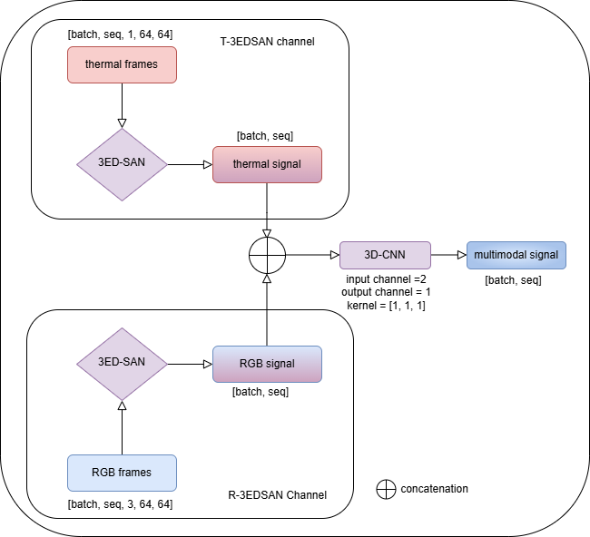
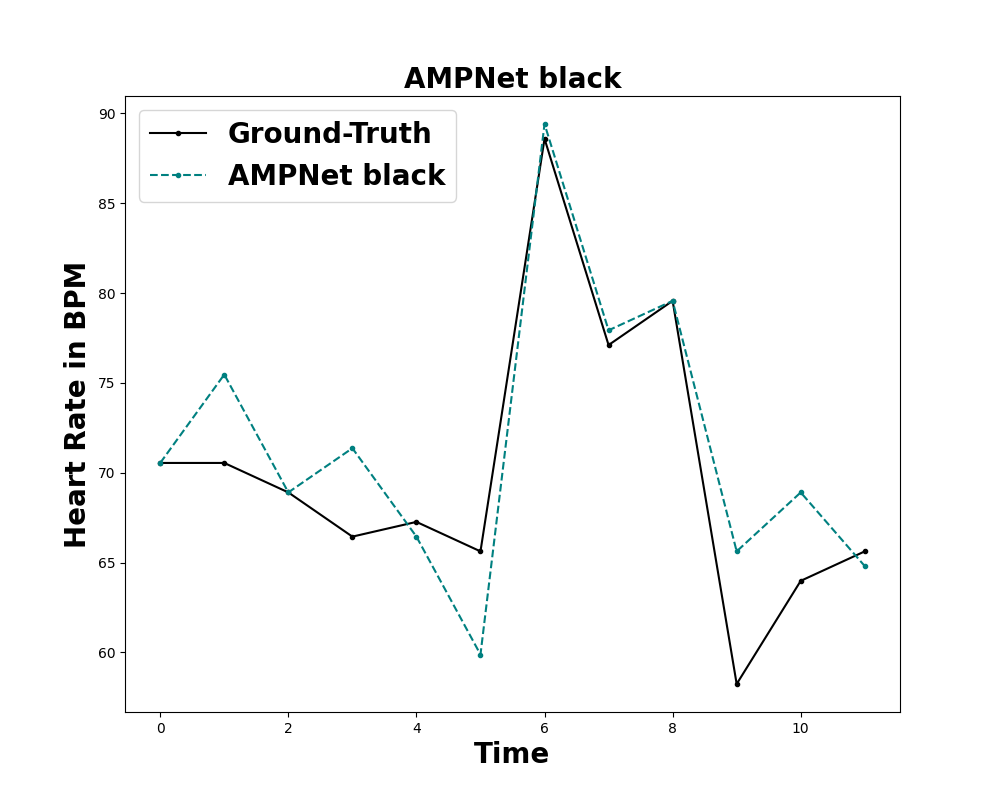
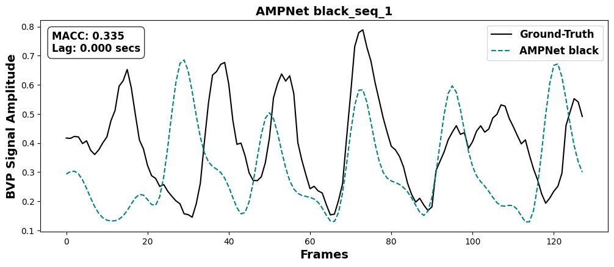

# AMPNet: Attentive Multimodal Pulse Network for Robust & Fair rPPG

Official implementation of **AMPNet**, a multimodal deep learning framework for remote photoplethysmography (rPPG) using RGB and thermal data.

---

## 📄 Paper

**AMPNet: An Attentive Multimodal Pulse Network for Equitable and Robust Remote Photoplethysmography**

---

## 🧠 Overview

Remote photoplethysmography (rPPG) enables non-contact heart rate estimation from facial videos. However, existing methods suffer from:

- sensitivity to illumination and motion  
- reduced performance across skin tones  
- limitations of single-modality approaches  

**AMPNet addresses these challenges by:**

- combining RGB and thermal modalities  
- using a 3D CNN encoder–decoder (3EDSAN)  
- applying spatiotemporal attention  
- performing decision-level fusion  

---

## 🏗️ Project Structure

```
rPPG-project-main/
├── train.py
├── test.py
├── config.py
├── data/
├── evaluation/
├── signals/
├── utils/
├── src/
├── perturbations.py
├── notebooks/
├── plots/
└── README.md
```

---

## 🧾 Data Format & Shapes

### Input Shape
```
(N, C, T, H, W)
```

- `C = 4` → RGB (3) + Thermal (1)  
- `T = 128` frames per segment  
- `H, W = 64 × 64`  

Example:
```
(672, 4, 128, 64, 64)
```

### Labels
```
(N, T)
```

---

### Full Sequence Reconstruction

- Default full sequence length: **1792 frames**
- Segments per sequence:
```
1792 / 128 = 14
```

### ⚠️ Constraint
```
FULL_SEQUENCE_LENGTH % SEGMENT_LENGTH == 0
```

---

### Configuration (`config.py`)
```python
SEGMENT_LENGTH = 128
FULL_SEQUENCE_LENGTH = 1792
SAMPLING_RATE = 28
```

---

## ⚙️ Installation

```bash
git clone https://github.com/Ogoskino/AMPNet-rPPG.git
cd rPPG-project-main
conda create -n rppg python=3.9
conda activate rppg
pip install -r requirements.txt
```

---

## 🏋️ Training

```bash
python train.py
```

---

## 🧪 Testing

```bash
python test.py
```

---

## 📈 Evaluation Pipeline

1. Predict on 128-frame segments  
2. Reconstruct full sequences  
3. Apply signal processing  
4. Extract heart rate  
5. Compute metrics  

---

## 📊 Results

### Quantitative Results

Performance on the iBVP dataset. Lower MAE/RMSE is better, while higher r, SNR, and MACC is better.

| Model | MAE ↓ | RMSE ↓ | r ↑ | SNR ↑ | MACC ↑ |
|------|------:|-------:|----:|------:|-------:|
| PhysNet | 2.717 | 5.957 | 0.716 | 7.433 | 0.624 |
| iBVPNet | 3.264 | 6.438 | 0.643 | 5.522 | 0.555 |
| RTrPPG | 2.666 | 5.877 | 0.734 | 5.680 | 0.504 |
| 3EDSAN | 1.504 | 3.033 | 0.933 | 7.095 | 0.628 |
| AMPNet | **1.248** | **2.458** | **0.958** | 7.098 | **0.696** |

---

### Model Architecture



---

### Example Outputs





---

## ⚖️ Fairness & Robustness

- evaluated across demographic groups  
- improved fairness vs RGB-only models  
- robust to resolution degradation  
- sensitive to temporal perturbations  

---

## 🚧 Limitations

- single dataset evaluation  
- thermal noise  
- temporal sensitivity  

---

## 🔮 Future Work

- cross-dataset validation  
- real-time deployment  
- improved temporal modelling  

---

## 📚 Citation

```bibtex
@ARTICLE{11589532,
  author={Okafor, Ogonna and Adama, David Ada and Dangana, Muhammad and Vinkemeier, Doratha},
  journal={IEEE Sensors Journal}, 
  title={AMPNet: An Attentive Multimodal Pulse Network for Equitable and Robust Remote Photoplethysmography (rPPG)}, 
  year={2026},
  volume={},
  number={},
  pages={1-1},
  keywords={Modeling;Heart rate;Videos;Training;Estimation;Measurement;Skin;Modules (abstract algebra);Attention mechanisms;Signal to noise ratio;Blood Volume Pulse (BVP) estimation;Convolutional Block Attention Module (CBAM);Multimodal fusion;Remote photoplethysmography (rPPG);RGB–thermal imaging;Spatiotemporal attention;Temporal Attention Module (TAM)},
  doi={10.1109/JSEN.2026.3706851}}
```

---

## 👤 Author

Ogonna Okafor  
Nottingham Trent University
