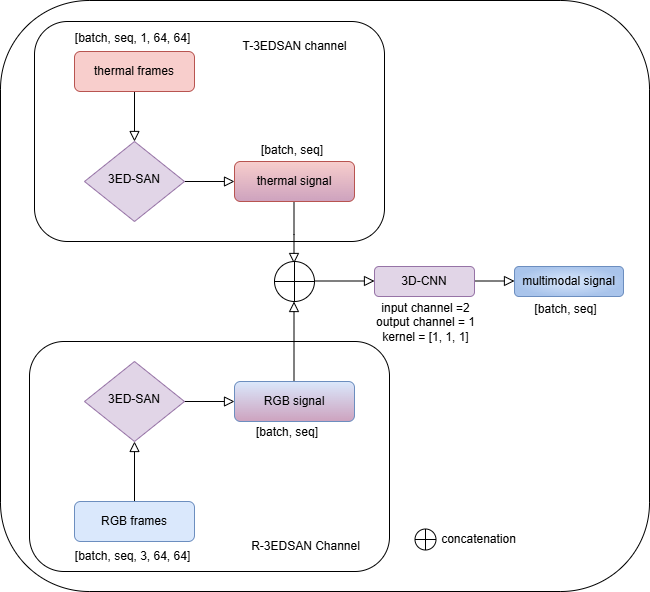
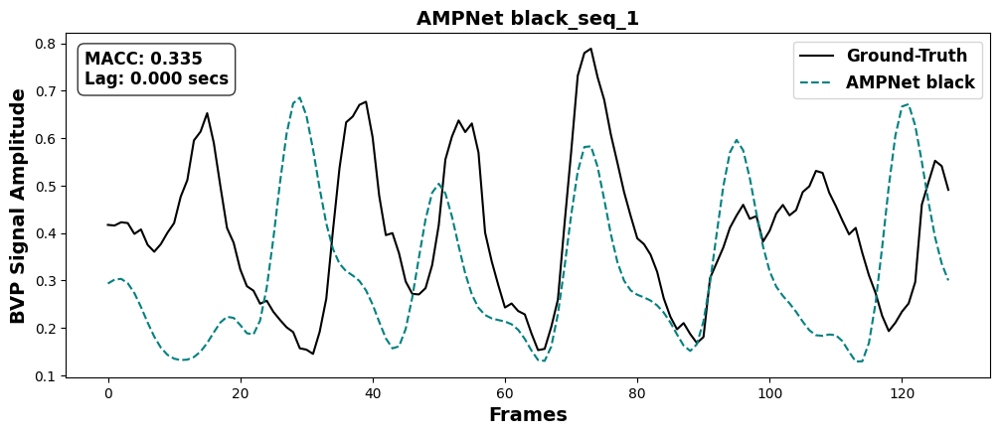
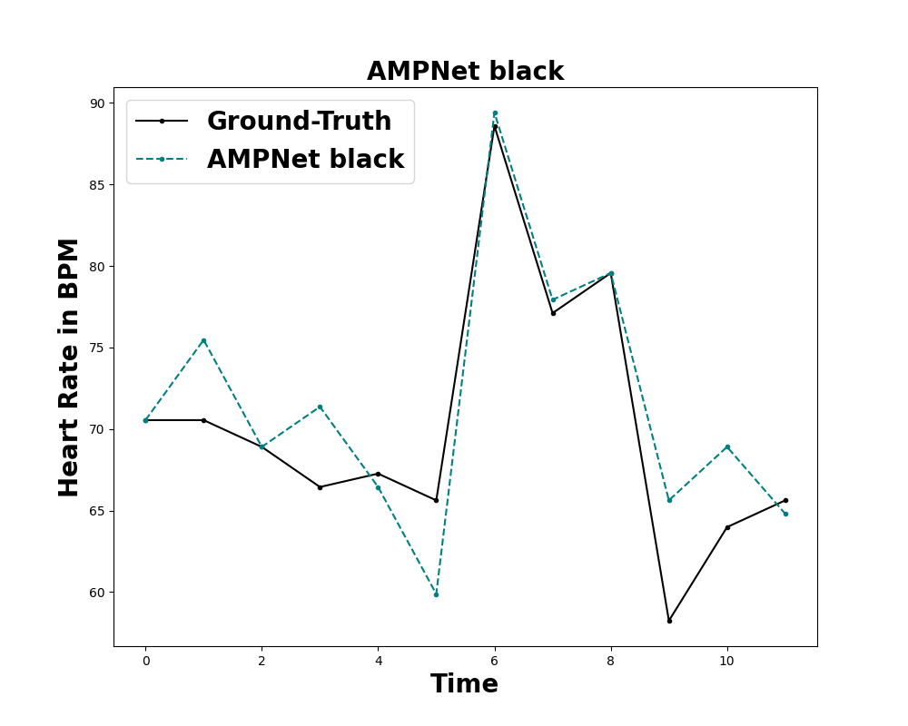

# AMPNet

Code and pretrained models for [AMPNet: An Attentive Multimodal Pulse Network for Equitable and Robust Remote Photoplethysmography (rPPG)](https://doi.org/10.1109/JSEN.2026.3706851), published in *IEEE Sensors Journal* (2026).

Estimating pulse from facial video is sensitive to lighting, movement, and skin tone. AMPNet combines RGB and thermal facial recordings to study how these two sources of information can improve pulse estimation.

## Method

AMPNet processes RGB and thermal face crops in separate 3D convolutional encoder–decoder networks. Channel, spatial, and temporal attention help each branch select useful features across the face and over time. Each branch estimates a pulse waveform. A learned fusion layer combines the normalized RGB and thermal predictions into the final rPPG waveform.



The repository includes the RGB and thermal branches, their attention variants, the fusion model, and the PhysNet, iBVPNet, and RTrPPG comparison models.

## Results

The following results are reported for iBVP. MAE and RMSE measure heart-rate error, while `r`, SNR, and MACC describe correlation and signal quality. Lower error and higher correlation, SNR, and MACC are better.

| Model | MAE | RMSE | r | SNR | MACC |
|---|---:|---:|---:|---:|---:|
| PhysNet | 2.717 | 5.957 | 0.716 | **7.433** | 0.624 |
| iBVPNet | 3.264 | 6.438 | 0.643 | 5.522 | 0.555 |
| RTrPPG | 2.666 | 5.877 | 0.734 | 5.680 | 0.504 |
| 3EDSAN | 1.504 | 3.033 | 0.933 | 7.095 | 0.628 |
| AMPNet | **1.248** | **2.458** | **0.958** | 7.098 | **0.696** |

<details>
<summary>Example waveforms and heart-rate estimates</summary>





</details>

## Installation

Python 3.12 is recommended. Prediction has been tested on Windows and Linux with PyTorch 2.6.0 and NumPy 1.26.4.

```bash
git clone https://github.com/Ogoskino/AMPNet-rPPG.git
cd AMPNet-rPPG
python -m venv .venv
```

Activate the environment in Windows PowerShell with

```powershell
.venv\Scripts\Activate.ps1
```

or in Linux/macOS with

```bash
source .venv/bin/activate
```

Then install the prediction dependencies.

```bash
python -m pip install -r requirements-predict.txt
```

The trained weights are included in the repository.

## Prediction

A quick installation check runs AMPNet on randomly generated input and saves a waveform file.

```bash
python predict.py --model ampnet --demo --output demo_waveform.npz --device cpu
```

### Prepare the input

For prediction on your own recordings, first crop and resize the faces to 64 × 64 pixels, normalize the values to `[0, 1]`, and divide each recording into 128-frame segments. RGB and thermal crops should show the same face over the same time interval. These preparation steps take place before running `predict.py`.

The input shape is `(N, C, 128, 64, 64)`, where `N` is the number of segments and `C` is the number of channels.

| Input | Model names for `--model` | Channels |
|---|---|---:|
| RGB and thermal | `ampnet` | 4, ordered R, G, B, thermal |
| RGB | `r3edsan`, `physnet`, `ibvpnet`, `rtrppg` | 3, ordered R, G, B |
| Thermal | `t3ed`, `t3edsan-tam`, `t3edsan-cbam`, `t3edsan-cs` | 1 |

Save the normalized, floating-point array as a `.npy` file, a `.npz` file under the key `frames`, or a plain PyTorch tensor in a `.pt` or `.pth` file. [The prediction guide](PREDICTION.md) explains data preparation and gives examples for each modality.

### Run the model

```bash
python predict.py --model ampnet --input crops.npz --output prediction.npz --device cpu --fps 28
```

Use `--device auto` to use a CUDA GPU when available. The `--fps` value records the input frame rate; it does not resample the video. Add `--overwrite` when intentionally replacing an existing output.

The output contains one 128-sample waveform per input segment. AMPNet also saves the separate RGB and thermal predictions.

```python
import numpy as np

with np.load("prediction.npz", allow_pickle=False) as result:
    fused = result["waveform"]
    rgb = result["rgb_waveform"]
    thermal = result["thermal_waveform"]

print(fused.shape)  # (N, 128)
```

These are pulse waveforms. Heart-rate estimation is handled separately by the signal-processing and evaluation code. Pretrained weights are selected automatically through [src/checkpoints.json](src/checkpoints.json).

## Training and evaluation

Training requires prepared facial recordings and their reference pulse waveforms. Install the additional dependencies first.

```bash
python -m pip install -r requirements.txt
```

Create a `datasets/` directory and place the saved PyTorch tensors in it.

```text
datasets/
├── ibvp_train_features.pth
├── ibvp_train_labels.pth
├── ibvp_test_features.pth
└── ibvp_test_labels.pth
```

Alternatively, set `AMPNET_DATA_DIR` to the directory containing these files.

The training and evaluation loader expects whole recordings with shape `(N, T, 64, 64, C)` and reference waveforms with shape `(N, T)`. It splits the recordings into 128-frame segments and moves the channel dimension into the order required by the models. This is different from `predict.py`, which accepts segments that have already been prepared.

Review [config.py](config.py) before running an experiment. The iBVP settings use 28 frames/s and 1,792 frames per recording, giving 14 segments. `MODALITY` selects RGB, thermal, or multimodal training. In multimodal mode, the fusion model is trained using the supplied RGB and thermal branch weights.

Keep segments from each recording together and in chronological order for session-level evaluation. The demographic evaluation also expects recordings to be arranged in the groups defined in `config.py`; it does not read demographic labels automatically.

```bash
python train.py
python test.py
```

Training logs are saved to `mlruns/`. A separate MLflow server is optional and can be selected through `MLFLOW_TRACKING_URI`.

## Repository structure

```text
AMPNet-rPPG/
├── predict.py             Pretrained model prediction
├── train.py               Model training
├── test.py                Dataset evaluation
├── config.py              Data paths and experiment settings
├── data/                  Tensor loading and segmentation
├── src/                   Model definitions and prediction utilities
├── model_paths/           Trained weights
├── preprocessing/         Face-video preprocessing
├── evaluation/            Losses, metrics, and robustness experiments
├── signals/               Signal-processing utilities
├── utils/                 Data splitting and model helpers
└── tests/                 Automated software tests
```

## Tests

The automated checks cover input validation, checkpoint loading, and prediction for all nine models. They use synthetic inputs to test the software rather than reproduce the paper's accuracy results.

```bash
python -m unittest discover -s tests -p "test_*.py" -v
python tests/smoke_pretrained.py
```

[View the Windows and Linux test results](https://github.com/Ogoskino/AMPNet-rPPG/actions/workflows/prediction.yml).

## Citation

```bibtex
@article{okafor2026ampnet,
  author  = {Okafor, Ogonna and Adama, David Ada and Dangana, Muhammad and Vinkemeier, Doratha},
  title   = {{AMPNet}: An Attentive Multimodal Pulse Network for Equitable and Robust Remote Photoplethysmography ({rPPG})},
  journal = {IEEE Sensors Journal},
  year    = {2026},
  doi     = {10.1109/JSEN.2026.3706851}
}
```
